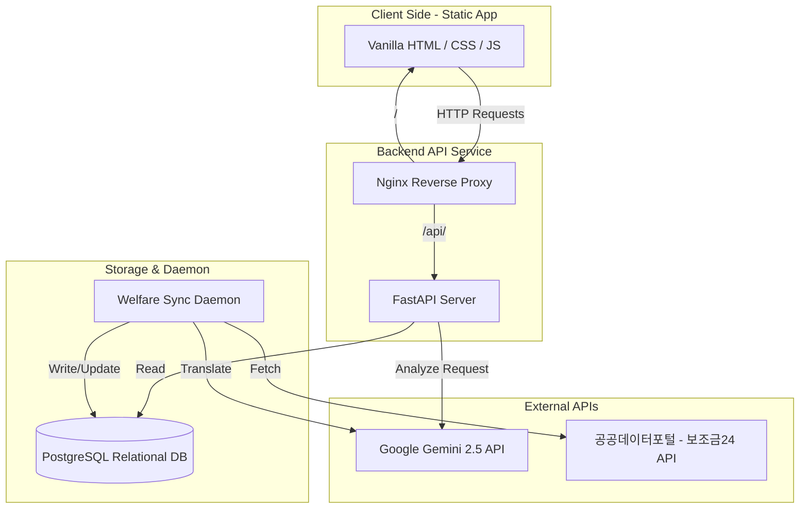

# 🏆 다온 (Daon)
> **"우리 곁의 착한 AI, 일상을 바꾸는 상상력"**
>
> **K-AI Contents Award (Track B. 솔루션 부문) 출품작**  
> 다문화 가정을 위한 RAG 기반 맞춤형 생활·교육 AI 비서 서비스

---

## 💡 1. 기획 배경 및 필요성
다문화 가정의 인구는 매년 빠르게 증가하고 있으나, 여전히 언어적 장벽과 한국 고유의 교육·행정 시스템에 대한 이해 부족으로 복지 소외와 정보 격차를 겪고 있습니다.
* **교육 정보 격차**: 초·중·고교의 가정통신문이나 알림장에는 한자어나 행정적 표현(예: '지참', '제출', '구비')이 많아 단순 번역기로는 학부모가 준비물이나 일정을 놓치기 쉽습니다.
* **복지 혜택 소외**: 소득 수준이나 거주지, 자녀 나이에 따라 받을 수 있는 수많은 정부 혜택이 존재하지만, 신청 절차가 까다롭고 관련 공고를 제때 확인하지 못해 수혜를 받지 못하는 경우가 빈번합니다.

**"다온 (Daon)"**은 AI 기술을 통해 정보 격차를 없애고 다문화 가정이 한국 사회에 따뜻하게 온보딩될 수 있도록 돕는 착한 AI 솔루션입니다.

---

## ✨ 2. 핵심 기능 (Core Features)

### 📸 ① RAG 기반 서류/행정 도우미
* **OCR 연동 텍스트 추출**: 가정통신문이나 알림장의 사진을 업로드하거나 텍스트를 입력합니다.
* **한국 교육/행정 백과사전 RAG 검색**: 추출한 텍스트에서 키워드를 도출하고, 한국의 독특한 문화(예: 실내화 보관함, 주간학습안내 서명제도 등)가 담긴 지식 DB에서 검색(Retrieval)합니다.
* **다국어 맞춤 해설 생성**: 단순 어휘 번역을 넘어 **[1. 핵심 일정, 2. 챙겨야 할 준비물, 3. 제출해야 할 서류]**를 번역 요약해주고, 한국 문화에 대한 상세한 추가 해설을 함께 제공합니다.

### 🔔 ② 프로필 기반 복지 혜택 매칭 & 알림
* **온보딩 개인화 프로필**: 다문화 학부모의 주 사용 언어, 자녀 나이, 소득 분위, 거주 지역 정보를 설정합니다.
* **실시간 복지 매칭**: 수집된 보조금24 및 지자체 복지 API 정보와 사용자 프로필을 비교하여 수혜 대상 혜택을 필터링합니다.
* **다국어 모바일 푸시 알림**: 조건에 맞는 신규 혜택이 신설되면 사용자의 선호 언어로 번역된 브라우저 백그라운드 푸시 알림(Web Push)을 발송합니다.

---

## 🏗️ 3. 서비스 아키텍처 (System Architecture)



* **Client**: Vanilla HTML5 + CSS3 + Vanilla JS (SPA 구조로 Nginx로 정적 서빙)
* **Server**: FastAPI (Nginx 리버스 프록시 연동 및 Gemini API 텍스트/이미지 통합 분석 엔드포인트 구현)
* **Database**: PostgreSQL (RDB - 다국어 복지 혜택 데이터를 테이블에 캐싱하여 조회 속도 극대화)
* **Daemon**: Background Python Sync Daemon (Systemd 서비스로 등록되어 주기적으로 공공데이터를 갱신 및 DB에 Upsert)
* **External AI API**: Google Gemini 2.5 API (OCR 텍스트 추출, 다국어 번역, RAG 요약 및 한국 문화 해설을 원스톱 일괄 처리)

---

## 💡 4. 핵심 AI 프롬프트 (Prompt Design)
본 솔루션의 고도화된 RAG 및 매칭 기능을 수행하기 위해 적용된 핵심 프롬프트 예시입니다.

### 📝 RAG 기반 통신문 요약 및 해설 프롬프트
```markdown
너는 사회생활 및 학교 생활에 서툰 다문화 가정 학부모를 돕는 다정하고 전문적인 초등학교 교사이자 통역사야.

[입력 데이터]
- 추출된 가정통신문 텍스트: {통신문 텍스트}
- 사용자가 선택한 모국어: {선택 언어 (예: 베트남어)}

[수행 태스크]
1. 입력된 통신문에서 학부모가 반드시 알아야 하는 핵심 내용을 아래의 3가지 항목으로 요약해 줘.
   - 📅 [핵심 일정 및 일시]
   - 🎒 [챙겨야 할 준비물]
   - ✍️ [부모가 제출하거나 서명해야 할 것]
2. 요약된 내용을 한국어와 지정된 {선택 언어}로 병행 표기해 줘.
3. 통신문에 언급된 한국 학교 특유의 문화(예: 실내화, 주간학습안내, 급식 신청 등)가 있다면, 다문화 학부모가 오해하지 않도록 모국어로 친절한 추가 설명을 덧붙여 줘.
```

### 🔔 복지 혜택 대상자 판정 및 번역 프롬프트
```markdown
[입력 데이터]
1. 사용자 프로필: { 자녀: 7세 1명, 소득분위: 중위 70%, 거주지: 서울시 마포구, 선호 언어: 베트남어 }
2. 신규 복지 서비스 정보: { 서비스명: "다문화가정 자녀 입학 준비금 지원", 대상자 요건: "소득 중위 100% 이하의 다문화 가정 중 올해 초등학교 입학(8세) 예정 아동을 둔 가구", 지원 내용: "도서 및 가방 구입비 10만 원 지급" }

[수행 태스크]
1. 사용자 프로필과 복지 서비스 요건을 분석하여 대상자 여부를 판단해 줘. (판단 근거도 간략히 작성)
2. 대상자가 맞다면, 선호 언어({선호 언어})로 다음 내용을 포함한 모바일 푸시 알림용 문구를 100자 내외로 작성해 줘.
   - 혜택의 핵심 요약 (무엇을 주는지)
   - 신청 방법 또는 기한 안내
```

---

## 🛠️ 5. 개발 환경 및 로컬 실행 방법

### Docker를 활용한 데모 실행 방법
본 데모는 Docker Compose 환경으로 웹 서버가 컨테이너화되어 있어 손쉽게 구동이 가능합니다.

1. **Docker 컨테이너 빌드 및 백그라운드 실행**
   ```bash
   docker compose up --build -d
   ```
2. **Nginx 설정 및 역프록시 구성**
   포트 `8400`번으로 서빙되는 컨테이너를 외부 Nginx 설정을 통해 `/daon/` 주소로 연동합니다.

---
*본 프로젝트는 K-AI Contents Award 출품 및 검증을 위해 설계된 다문화 가정 특화형 AI 솔루션 프로토타입입니다.*
