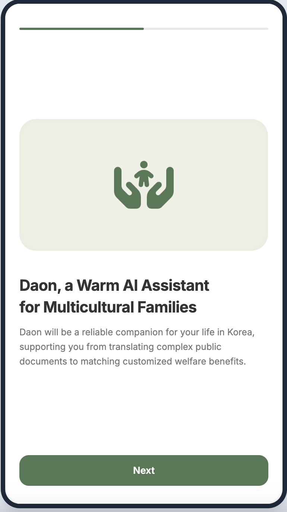
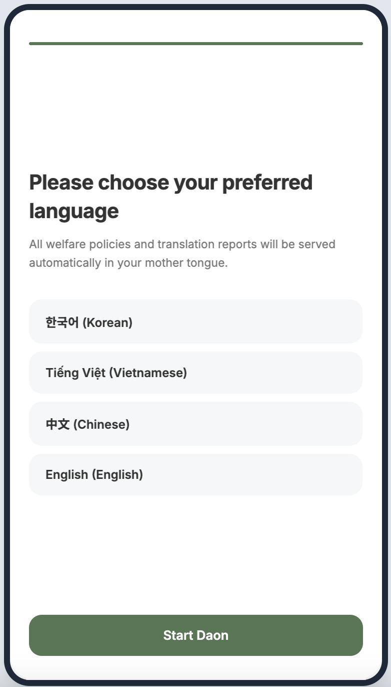
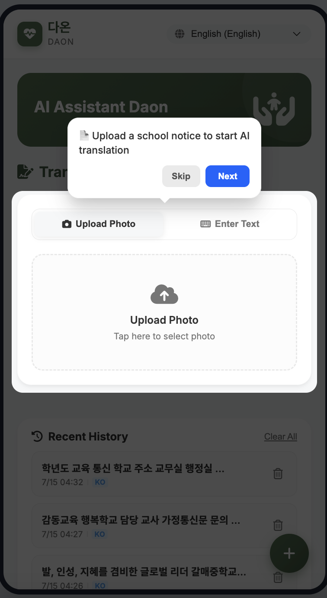
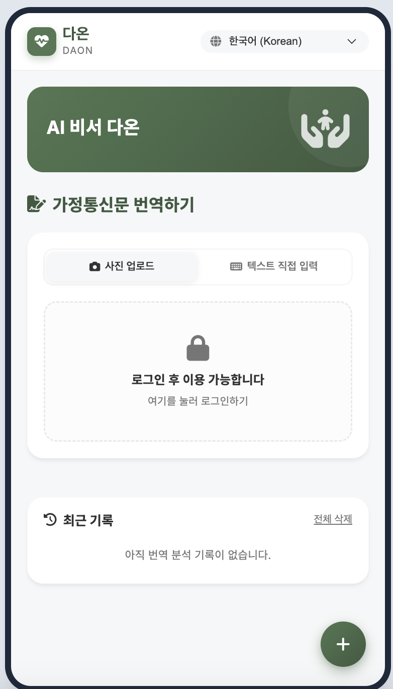
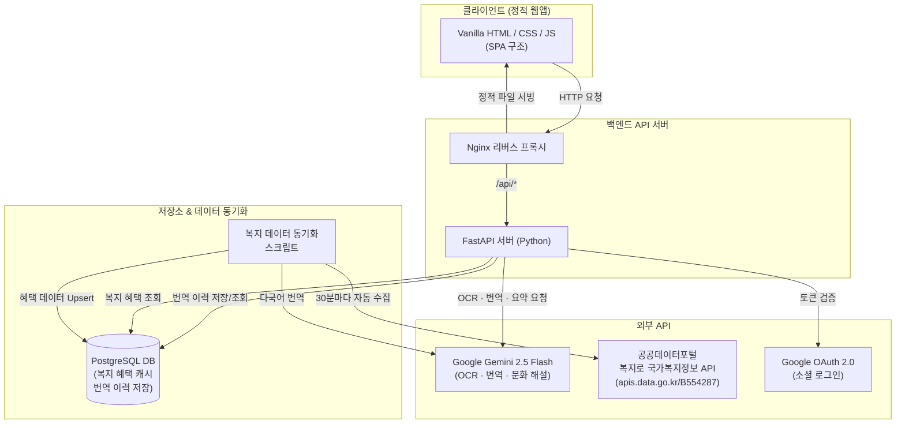

# 🌏 다온 (Daon)
> **"우리 곁의 착한 AI, 일상을 바꾸는 상상력"**
>
> **K-AI Contents Award — Track B. 솔루션 부문 출품작**
> 다문화 가정 학부모를 위한 AI 기반 알림장 번역 & 복지 혜택 안내 서비스

[다온(Daon) 서비스 바로가기](https://daon-k-ai.duckdns.org/)
---

| 온보딩 1 | 온보딩 2 |
| :-: | :-: |
|  |  |
| **어플 튜토리얼** | **어플 화면** |
|  |  |


## 💡 1. 기획 배경 및 해결하는 문제

한국의 다문화 가정 수는 매년 빠르게 증가하고 있지만, 언어 장벽과 한국 교육·행정 시스템에 대한 낯섦으로 인해 심각한 **정보 격차**를 겪고 있습니다.

| 문제 | 구체적 상황 |
|---|---|
| 📄 **교육 정보 격차** | 가정통신문·알림장에는 행정·한자어 표현(예: '지참', '구비', '협조사항')이 많아 단순 번역기로는 준비물·일정을 놓치기 쉬움 |
| 🏛️ **복지 혜택 소외** | 다양한 정부 지원이 존재하지만, 정보 접근성 부족으로 수혜를 놓치는 경우 빈번 |
| 🌐 **문화적 맥락 부재** | '실내화', '주간학습안내', '늘봄교실' 등 한국 학교 고유 문화는 직역으로는 이해 불가 |

다온은 AI가 학교 가정통신문을 요약하여 학부모가 편하게 읽을 수 있도록 다양한 언어로 핵심 내용을 정리해주며, 받을 수 있는 정부 지원도 함께 안내하는 **AI 가정통신문 튜터**입니다.

---

## ✨ 2. 핵심 기능

### 📸 ① AI 알림장 번역 & 분석 (메인 기능)
- **사진 업로드 또는 텍스트 직접 입력** 지원
- **OCR**: Google Gemini Vision API로 이미지에서 한국어 텍스트 추출
- **구조화된 3단 요약**: 단순 번역을 넘어 아래 3가지 카테고리로 핵심만 분리
  - ✍️ 부모가 제출하거나 서명해야 할 서류
  - 🎒 아이가 챙겨야 할 준비물
  - 📅 놓치면 안 되는 주요 일정
- **전체 번역본**: 더보기 방식으로 원문 전체 번역 제공
- **한국 문화 해설**: '실내화', '늘봄교실' 등 외국인이 이해하기 어려운 개념을 모국어로 친절하게 설명
- **지원 언어**: 한국어 🇰🇷 · 베트남어 🇻🇳 · 중국어 🇨🇳 · 영어 🇺🇸 (향후 확장 예정)

### 🏛️ ② 복지 혜택 안내 피드
- **복지로 국가복지정보 API** 연동으로 최신 정부 지원 혜택 실시간 제공
- 다문화 가정·아동·가족 관련 혜택만 필터링하여 표시
- 카드형 UI로 제목, 지원 내용, 신청 방법, 출처 링크 제공
- 4개 언어로 자동 번역 제공 (향후 확장 예정)

### 👤 ③ 개인화 & 번역 이력
- **구글 소셜 로그인** 지원
- **번역 이력 저장**: 과거에 분석한 알림장을 언제든 다시 확인 가능

### 🎓 ④ 인터랙티브 온보딩 튜토리얼
- 첫 방문자를 위한 단계별 앱 사용 가이드
- 앱의 주요 기능을 직접 안내하며 학습 장벽 최소화

---

## 🏗️ 3. 시스템 아키텍처



| 레이어 | 기술 스택 | 역할 |
|---|---|---|
| **프론트엔드** | Vanilla HTML5 / CSS3 / JavaScript | SPA 구조, 단일 파일로 관리. Nginx로 정적 서빙 |
| **백엔드** | FastAPI (Python) | OCR, 번역·분석 API 엔드포인트, 인증, 이력 관리 |
| **데이터베이스** | PostgreSQL | 복지 혜택 캐싱, 사용자 번역 이력 저장 |
| **AI 엔진** | Google Gemini 2.5 Flash | 이미지 OCR, 다국어 번역, 3단 요약, 문화 해설 생성 |
| **복지 데이터** | 공공데이터포털 복지로 API | 국가·지자체 복지 혜택 정보 수집 및 DB 동기화 |
| **인증** | Google OAuth 2.0 | 소셜 로그인 및 사용자 세션 관리 |
| **인프라** | Docker Compose + Nginx | 컨테이너 기반 배포, 리버스 프록시 |

---

## 💡 4. 핵심 AI 프롬프트 (Prompt Design)

### 📝 알림장 번역 · 요약 · 문화 해설 프롬프트

서비스 핵심인 알림장 분석에 사용되는 실제 프롬프트 구조입니다.

```
You are a kind and professional elementary school teacher and translator
helping multicultural families.

Analyze the provided primary notice/document.

Tasks:
1. Extract the original Korean text from the document.
2. Translate the content and summarize the core information that parents MUST
   know into three categories (written 100% in the target language):
   - 📅 Key Dates & Times
   - 🎒 Materials to Prepare
   - ✍️ Documents to Submit / Sign / Cooperation
   Format them as HTML tags (h4, ul, li, p).
3. Generate the full translation in the target language.
4. If there are unique Korean school culture terms (e.g. 실내화, 주간학습안내,
   늘봄교실), explain them in detail in the target language inside a div with
   class "culture-note".

Respond with a strictly valid JSON object:
{
  "extracted_text": "...",
  "schedule": "HTML content...",
  "materials": "HTML content...",
  "submissions": "HTML content...",
  "full_translation": "...",
  "cultural_notes": "HTML content..."
}
```

**설계 의도:**
- `Kind teacher` 페르소나: 기계적 번역이 아닌 교사가 설명하듯 따뜻한 어조
- 3단 구조화: 학부모가 '무엇을 해야 하는지'를 바로 파악할 수 있도록 카테고리 분리
- 문화 해설 필드 분리: 일반 요약과 문화 설명을 구분하여 UI에서 별도 렌더링

---

## 📦 5. 오픈소스 및 공공데이터 라이선스

> **출처 표기**: 본 서비스에서 제공하는 복지 혜택 정보는 **복지로(www.bokjiro.go.kr) 국가복지정보시스템**의 공공데이터를 활용하며, 공공누리 제1유형 라이선스에 따라 출처를 표기합니다.

### 주요 오픈소스 라이브러리
| 라이브러리 | 용도 | 라이선스 |
|---|---|---|
| FastAPI | 백엔드 API 프레임워크 | MIT |
| Pillow | 이미지 압축 처리 | HPND |
| psycopg2 | PostgreSQL 연결 | LGPL |
| Font Awesome (Free) | 아이콘 | MIT / CC BY 4.0 |
| Google Fonts (Noto Sans KR) | 한국어 폰트 | SIL OFL 1.1 |

---

## 🛠️ 6. 로컬 실행 방법

### 사전 요구사항
- Docker & Docker Compose 설치
- Google Gemini API 키
- (선택) 공공데이터포털 API 키, Google OAuth Client ID

### 실행

```bash
# 1. 환경 변수 설정
cp .env.example .env
# .env 파일에 GEMINI_API_KEY 등 입력

# 2. 컨테이너 빌드 및 실행
docker compose up --build -d

# 3. 접속
# http://localhost:8400
```

### 환경 변수 목록 (`.env`)

```
GEMINI_API_KEY=          # Google Gemini API 키 (필수)
GOOGLE_CLIENT_ID=        # Google OAuth 클라이언트 ID
DATA_PORTAL_API_KEY=     # 공공데이터포털 API 키 (복지 데이터 수집용)
DB_HOST=host.docker.internal
DB_PORT=5432
DB_USER=daon_user
DB_PASSWORD=your_strong_password
DB_NAME=daondb
LLM_PROVIDER=gemini
```

---

## 📁 7. 프로젝트 구조

```
K-AI-Award/
├── index.html           # 프론트엔드 SPA (단일 페이지)
├── style.css            # 전체 스타일 (다크/라이트 테마, 애니메이션)
├── app.js               # 프론트엔드 전체 로직 (번역, 이력, 온보딩 등)
├── main.py              # FastAPI 백엔드 (OCR·번역·인증·이력 API)
├── fetch_welfare_api.py # 복지로 공공데이터 동기화 스크립트
├── db_init.py           # PostgreSQL 초기화 스크립트
├── e2e_test.py          # E2E 통합 테스트
├── docker-compose.yml   # Docker 서비스 정의
├── Dockerfile           # 프론트엔드+Nginx 이미지
├── Dockerfile.backend   # FastAPI 백엔드 이미지
├── nginx.conf           # Nginx 리버스 프록시 설정
├── requirements.txt     # Python 의존성
├── .env.example         # 환경 변수 예시
├── AI_RULES.md          # AI 개발 규칙 및 컨벤션
└── DEVELOPER_GUIDE.md   # 개발자 가이드
```

---

*본 프로젝트는 K-AI Contents Award 출품 및 검증을 위해 설계된 다문화 가정 특화형 AI 솔루션입니다.*
*복지 혜택 정보는 복지로(www.bokjiro.go.kr) 공공데이터를 활용합니다.*
